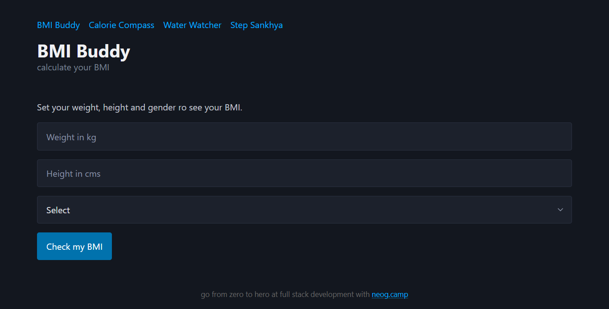
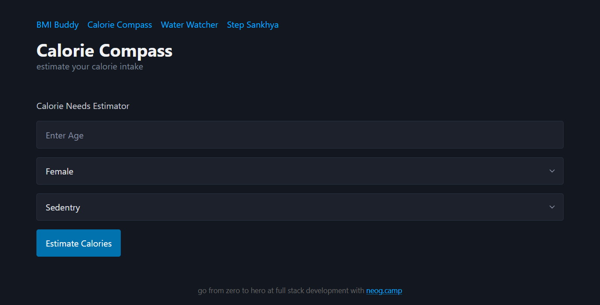
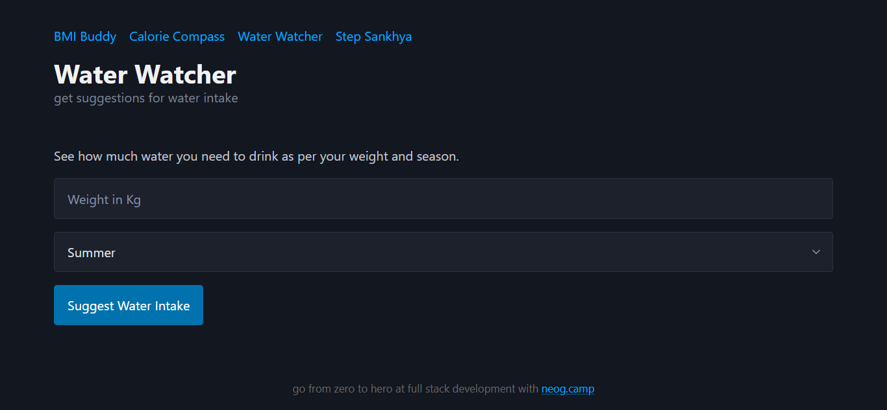
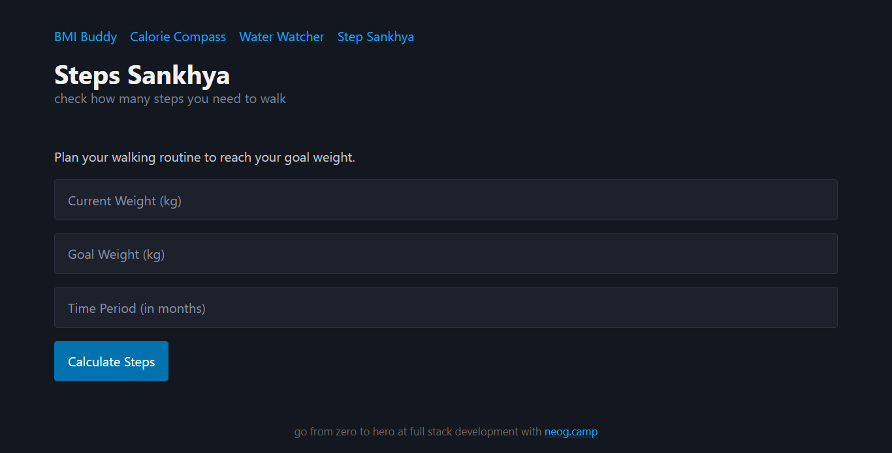

# 🧰 Fitness Tool Kit

A simple, responsive web app built using **HTML**, **Bootstrap**, **PicoCSS**, and **JavaScript** to help users track and manage basic fitness metrics like BMI, daily calorie needs, hydration, and step goals.

## 🚀 Live Demo

Check out the live version here: [Live App Link](#)

## 📌 Features

- ✅ **BMI Calculator** – Quickly calculate your Body Mass Index (`index.html`)
- ✅ **Daily Calorie Estimator** – Estimate your calorie needs based on activity level (`calories.html`)
- ✅ **Water Intake Guide** – Determine your recommended daily water intake (`water.html`)
- ✅ **Step Sankhya** – Calculate how many steps you need to walk daily to reach your weight goal (`steps.html`)
- ✅ **Responsive UI** – Designed with Bootstrap and PicoCSS for clean mobile and desktop experiences
- ✅ **Interactive** – JavaScript handles all fitness-related logic and validations

## 🛠️ Tech Stack

- **HTML** – Page structure
- **Bootstrap & PicoCSS** – Responsive and minimalist UI
- **JavaScript** – Logic and interactivity for all calculators

## 📂 Folder Structure

fitness-tool-kit/
│
├── index.html # BMI Buddy
├── calories.html # Calorie Compass
├── water.html # Water Watcher
├── steps.html # Step Sankhya
├── styles.css # Custom styling
├── script.js # Calculator logic (if shared)
├── /screenshots # App screenshots
└── README.md # Project documentation

## 📷 Screenshots

| BMI Buddy | Calorie Compass | Water Watcher | Step Sankhya |
|-----------|------------------|----------------|---------------|
|  |  |  |  |

## 🧠 What I Learned

- JavaScript DOM manipulation and input validation
- Real-life formula implementation (calories, steps, BMI)
- Styling with Bootstrap and PicoCSS for a clean, responsive layout
- Breaking a large idea into modular, goal-oriented mini tools

## 🙌 Acknowledgements

Built as part of my internship at **[neog.camp](https://neog.camp)** – where I’m learning by building real-world web apps from scratch.

## 📬 Feedback

Suggestions, issues, or collaboration ideas?  
Connect with me: [LinkedIn](https://www.linkedin.com/in/muruga-sutha-k/)

